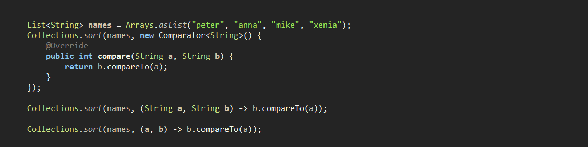
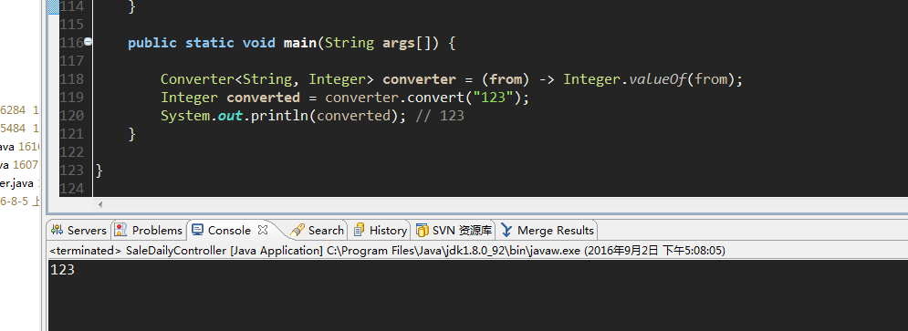
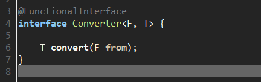
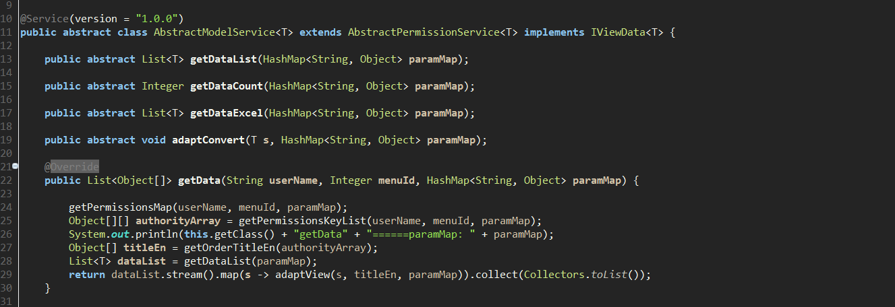
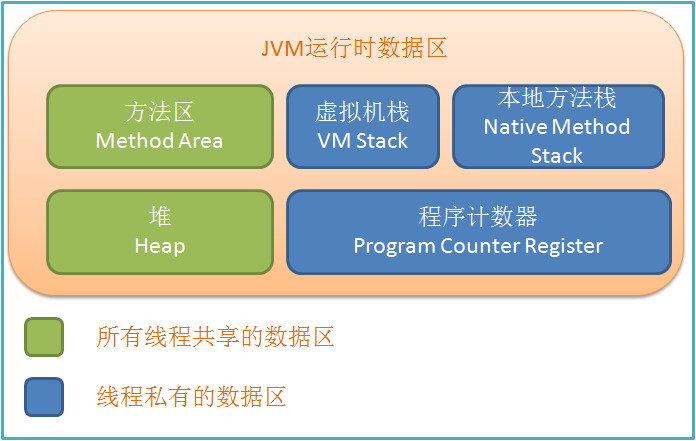

##1. jdk演变史

* ####JDK1.5

	1. 自动装箱与自动拆箱

			a. 每当需要一种类型的对象时，这种基本类型就自动地封装到与它相同类型的包装中

			b. 每当需要一个值时，被装箱对象中的值就被自动地提取出来，没必要再去调用intValue()和doubleValue()方法

	2. 枚举

	3. 静态导入

	4. 可变参数

			methodName([argumentList], dataType...argumentName);

	5. 内省（Introspector）

			一 般的做法是通过类Introspector来获取某个对象的BeanInfo信息

	6. 泛型(Generic)

	7. For-Each循环

* ####JDK1.6

	1. Desktop类和SystemTray类

	2. 使用JAXB2来实现对象与XML之间的映射

	3. 理解StAX
	
	4. 使用Compiler API

			methodName([argumentList], dataType...argumentName);

	5. 轻量级Http Server API

			一 般的做法是通过类Introspector来获取某个对象的BeanInfo信息

	6. 插入式注解处理API(Pluggable Annotation Processing API)

	7. 用Console开发控制台程序

    8.对脚本语言的支持如: ruby, groovy, javascript

    9.Common Annotations

* ####JDK1.7

	1. 对Java集合（Collections）的增强支持

	2. 在Switch中可用String

	3. 数值可加下划线

			int one_million = 1_000_000;

	4. 支持二进制文字

			int binary = 0b1001_1001;

	5. 简化了可变参数方法的调用

* ####JDK1.8

	1. 接口的默认方法

	2. Lambda 表达式

		

	3. 函数式接口
	
			Lambda 表达式是如何在java的类型系统中表示的呢？每一个lambda表达式都对应一个类型，通常是接口类型。而“函数式接口”是指仅仅只包含一个抽象方法的 接口，每一个该类型的lambda表达式都会被匹配到这个抽象方法。因为 默认方法 不算抽象方法，所以你也可以给你的函数式接口添加默认方法。

			我们可以将lambda表达式当作任意只包含一个抽象方法的接口类型，确保你的接口一定达到这个要求，你只需要给你的接口添加 @FunctionalInterface 注解，编译器如果发现你标注了这个注解的接口有多于一个抽象方法的时候会报错的。

		

		

	4. 方法与构造函数引用

	5. Lambda 作用域

		    在lambda表达式中访问外层作用域和老版本的匿名对象中的方式很相似。你可以直接访问标记了final的外层局部变量，或者实例的字段以及静态变量。

	6. 访问局部变量
	 
	7. 访问对象字段与静态变量

	8. 访问接口的默认方法

		a. Predicate接口

				Predicate 接口只有一个参数，返回boolean类型。该接口包含多种默认方法来将Predicate组合成其他复杂的逻辑（比如：与，或，非）

                and(Predicate<? super T> p) 

                negate()
   
                or(Predicate<? super T> p) 
				
				test(T t) 

				xor(Predicate<? super T> p)

        b. Function 接口

        c. Supplier 接口

        d. Consumer 接口

		e. Comparator 接口
  
        f. Optional 接口

        g. Stream 接口

			

			Filter 过滤

 			Sort 排序

            Map 映射

            Match 匹配

            Count 计数

            Reduce 规约

            并行Streams
       

    9. Date API

   10. Annotation 注解

##2. jdk内存模型

 
 
